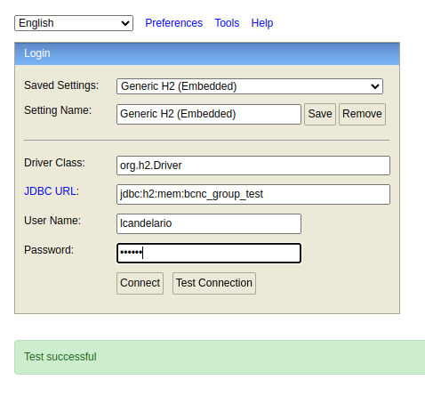

# BCNC Group - Backend Developer Exam  :detective:

This project is part of an interview process for a backend developer position at BCNC Group. 
The application is a Spring Boot service that provides an endpoint for querying product prices based on brand,
product, and application date.


## Table of Contents

- [Author Information](#author-information)
- [Prerequisites](#prerequisites)
- [Project Setup](#project-setup)
- [Running the Project](#running-the-project)
- [Database](#database)
- [Documentation](#documentation)
- [Test](#test)
- [Troubleshooting](#troubleshooting)
- [Information about the Project](#information-about-the-project)
- [Used Design Patterns](#used-design-patterns)

---

## Author Information

[](https://www.github.com/luis-knd)  :heavy_minus_sign:
[](https://wa.me/34666220562)  :heavy_minus_sign:
[](https://www.linkedin.com/in/candelario-luis/)

---

## Prerequisites

Before you begin, ensure you have the following installed on your local machine:

- [Docker](https://www.docker.com/get-started)
- [Docker Compose](https://docs.docker.com/compose/install/)
- [Git](https://git-scm.com/)


  You have needed the next ports available:

- 6868

---

## Project Setup

1. **Clone the Repository**

    Https repo:
   ```bash
   git clone https://github.com/luis-knd/bcncGroupTest.git
   ```
   
    Ssh repo:
   ```bash
   git clone git@github.com:luis-knd/bcncGroupTest.git
   ```
   
2. Navigate to the project directory.

3. Copy the environment file to the project directory.
    ```bash
    cp .env.example .env
    ```
   You can change the values in the `.env` file to your own values if you need.

---

## Running the project

Run the following command to build and start the application in the main path.
```bash
docker compose up --build -d
```

You need to wait for the application to start.

[Go to top :arrow_heading_up:](#table-of-contents)

---

## Database

We use [H2](https://www.h2database.com) as our database. To access the database, you can go to this [URL](http://127.0.0.1:6868/h2-console)
You would be watched a database window like this:



Remember put the values configured in the `.env` file. and click on Test connection to watch the successful message.

---

## Documentation
The documentation for this project is generated with [Swagger UI](https://springdoc.org/#Introduction). It provides a comprehensive overview of the 
API endpoints, request/response examples, and other relevant information.

To access the documentation, visit this [URL](http://localhost:6868/api/v1/documentation)


[Go to top :arrow_heading_up:](#table-of-contents)

---

## Test

**Run the tests suite**, in the main path execute this command:
```bash
docker exec bcnc_group_test_api mvn test 
```

If you want to know the code coverage, execute these commands:

   ```bash
   docker exec bcnc_group_test_api mvn jacoco:report
   ```

   Copy the result to the local folder.
   ```bash
   docker cp bcnc_group_test_api:/target/site/jacoco ./src/test/resources/
   ```

   [Open the coverage report](http://localhost:63342/bcnc_group_test/src/test/resources/jacoco/index.html).


[Go to top :arrow_heading_up:](#table-of-contents)

---

## Troubleshooting

1. If you obtain this error fragment :point_down: to build the project:

   ```text
    Caused by: java.lang.IllegalArgumentException: Could not resolve placeholder 'SPRING_LOCAL_PORT' in value "http://localhost:${SPRING_LOCAL_PORT}"
   ```
   
   Solution:

   You need to check the permission in the `.env` file. And assign it write permissions with this command:
   ```bash
   chmod +x .env 
   ```

[Go to top :arrow_heading_up:](#table-of-contents)

---

## Information About the Project

The project is a Java application based on Spring Boot, organized into several packages to adhere to clean and modular software design principles.

Each package and its purpose are described below:

1. config

   `SwaggerConfig`: This class configures Swagger for automatic generation of REST API documentation.

2. controllers

   This package contains the application's controllers, which handle HTTP requests and respond to clients. `BrandController`, `PriceController`, `ProductController`.

   2.1. dto

   Contains Data Transfer Objects (DTOs) used to transfer data between the application layers. `BrandDTO`, `PriceDTO`, `PriceToApplyDTO`, `ProductDTO`.

   2.1.1 mapper

   Contains classes that map entities to DTOs and vice versa, utilizing abstraction to simplify conversions. `BrandMapper`, `PriceMapper`, `ProductMapper`.

3. entities

	Contains classes that map entities to DTOs and vice versa, utilizing abstraction to simplify conversions. `Brand`, `CurrencyCode`, `Price`, `Product`.

4. exceptions

   Contains classes for handling application-specific exceptions.

   `ValidationExceptionHandler`: Class that handles validation exceptions.

5. handler

   ResponseHandler: Class that handles the structure of API responses.

6. persistence

   Contains interfaces and implementations of data access (DAO - Data Access Object). `IBrandDAO`, `IPriceDAO`, `IProductDAO`.

   6.1. impl

   Contains DAO (Data Access Object) implementations for the corresponding entities. `BrandDAOImpl`, `PriceDAOImpl`, `ProductDAOImpl`

7. services

   Interfaces and implementations of the service layer, responsible for business logic. `IBrandService`, `IPriceService`, `IProductService`

   7.1. impl

   Concrete implementations of services for the corresponding entities. `ProductServiceImpl`, `BrandServiceImpl`, `PriceServiceImpl`


[Go to top :arrow_heading_up:](#table-of-contents)

--- 

## Used Design Patterns

### DAO (Data Access Object)

This pattern is evident in the separation of interfaces and implementations within the `persistence` package. 
The interfaces (`IBrandDAO`, `IPriceDAO`, `IProductDAO`) define data access methods, while the implementations 
(`BrandDAOImpl`, `PriceDAOImpl`, `ProductDAOImpl`) provide concrete data access logic.


### DTO (Data Transfer Object)

Utilized in the `controllers.dto` package, DTOs (`BrandDTO`, `PriceDTO`, `ProductDTO`, `PriceToApplyDTO`) are employed 
to transfer data between application layers without directly exposing entities.


### Mapper

Utilized in the `controllers.dto.mapper` package Mapper are employed for converting between entities and DTOs, 
thereby facilitating separation of concerns and simplifying conversion logic.


### Service Layer

The Service Layer pattern is observed in the separation of interfaces and implementations within the service package.
The interfaces (`IBrandService`, `IPriceService`, `IProductService`) define business methods, while the implementations
(`BrandServiceImpl`, `PriceServiceImpl`, `ProductServiceImpl`) provide concrete business logic.


[Go to top :arrow_heading_up:](#table-of-contents)